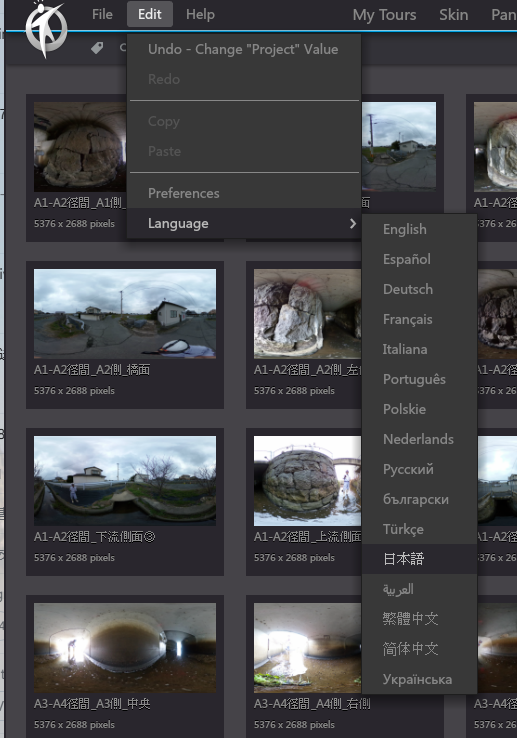

# 3DVista使用説明\_ソフト編

## はじめに


橋梁例


<mark style="color:red;">**New Project**</mark>を実行

<mark style="color:red;">**Import Skin**</mark>で，別ファイルとして渡した「skin\_3dvista\_1.vts」を読み込み，<mark style="color:red;">**Select**</mark>

<mark style="color:red;">**Import Panorama**</mark>を選択

<mark style="color:red;">**Standard Panorama**</mark>を選択

読み込む画像ファイルをまとめて選択→<mark style="color:red;">**開く**</mark>

このWarningが出たら，<mark style="color:red;">**Apply to All Panoramas**</mark>にチェックを入れて<mark style="color:red;">**Yes**</mark>

そしてProjectタブをクリックすると，このように読み込んだ写真が出てくる．

ここで，Project Name：というところに，橋の名前をいれる（今回は仮にSample Bridgeと入れます）

### 言語の変更

必要に応じて日本語化する．Edit→Language→日本語

パノラマタグに戻り，起点となり得る画像を開く．橋梁上面が望ましい．

右の枠にあるAdvanced Optionsというのを開く．

ここで，Zoom Settingsの最小を150, 初期状態も150にする．ローテーション速度のオートマチックを０にする．下のほうにあるオートプレイの設定のループ再生のチェックを外す．

これを，全ての画像に対して行う（大変ですが・・・）

そして画角を真ん中のビューでドラッグで指定後，右のパノラマ設定から，ビューを書記点として設定，をクリックする．

次に，パノラマの下のタブのホットスポットを選択，そして同じく橋梁上面の別画像を，その移動位置にドラッグアンドドロップする（ホットスポットをクリックしたら出てくるかもしれない解説動画も参考）．

そうすると，こんなポップアップが出てくるので，Create Return Hotspotにチェックが入っていることを確認後，右の3×3の升目みたいなものをクリックする．

移動先を表すアイコンの選択画面になるので，arrow01を選ぶ．

そうすると，移動先画像が開くので，移動元が，その移動先画像の中でどの部分にあるか，水色の●を移動させて指定し，そして追加をクリックする．

そうすると，元画像でもこのように行き先が現れるとともに

移動先でもこのように元画像へ戻るリンクができる．

以降はこのようにallow1のショートカットが作成されている．

プレビューで確認してクリックしたときの移動をチェックする．

損傷をホットスポットとして含める．右上のマークをクリック

損傷を囲う

線の色を黄色，厚さ3.0, 不透明度0.01にする．

## スキンの編集

<figure><figcaption></figcaption></figure>

<figure><figcaption></figcaption></figure>

## FloorPlanの追加

ToolBarの2番目にFloorPlanのボタンをクリックすると、FloorPlan Viewerのパネルが出てくる．（３Dマップ、レーダーの機能をしている）

FloorPlan Viewer特に設定する必要がなく、右から3番目のFloor Plansとリンク自動リンクしている。Floor Plansを設定することで、各レイヤーのレーダー情報が出てくる。次の節でFloor Plans（レーダー）の設定方法に参考してください。

<figure><figcaption></figcaption></figure>

### Dropdownバーの活用

DropdownをクリックするとFloorPlanの各レイヤーを選択でき、特定の画像にもジャンプできる。

<figure><figcaption></figcaption></figure>

<figure><figcaption></figcaption></figure>

損傷へのジャンプというところをクリックして，プロパティのAdvanced Optionsのメディアを見る：というところをカスタムに．そしてそこの横の歯車をクリックして，損傷のホットスポットを含むパノラマ画像を選ぶ．

<figure><figcaption></figcaption></figure>

<figure><figcaption></figcaption></figure>

裏面図というところをクリックして，プロパティのAdvanced Optionsのメディアを見る：というところを平面図のみ，に．また，アクションの下になにかぶらさがっていたら☓印を押して消す．

## レーダーを作る

<figure><figcaption></figcaption></figure>

平面図タブに行き，平面図を追加する．

<figure><figcaption></figcaption></figure>

上面図.pngと裏面図.pngを読み込む．ただし橋梁の状況によっては追加図作成が必要になるため，それについてはお絵かきソフトで適宜作成する．

<figure><figcaption></figcaption></figure>

平面図タブの下のレーダータブをクリックする．

<figure><figcaption></figcaption></figure>

ホットスポットをクリックして，写真を配置していく．

<figure><figcaption></figcaption></figure>

この画面で，右上の.png>)をクリックする．

<figure><figcaption></figcaption></figure>

赤丸を使うといいかもしれないです．

<figure><figcaption></figcaption></figure>

サイズは60px x 60px

アクションのところから，該当画像をロードする．

<figure><figcaption></figcaption></figure>

パノラマを開く

<figure><figcaption></figcaption></figure>

選択．

<figure><figcaption></figcaption></figure>

例えば合計２つ，上の画像のようになる．

<figure><figcaption></figcaption></figure>

レーダー，というタブをクリックする．そして右上の画像ファイル名をクリックする．

そして，レーダーの右側のボタンを押す．

そうするとレーダーが出てくるので，向きを合わせる．半径の長さは0.2，色は黄緑で．

橋梁裏面も同様に．

そしてファイル保存．

## エキスポート

ファイル→Create Project Backup with Mediaで，フォルダを作って指定．
