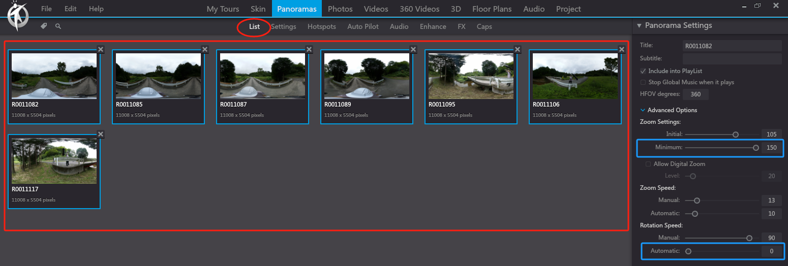

# 3DVista使用説明\_ソフト編

## はじめに


橋梁例


<mark style="color:red;">**New Project**</mark>を実行　Execute

<mark style="color:red;">**Import Skin**</mark>で，別ファイルとして渡した「skin\_3dvista\_1.vts」を読み込み，<mark style="color:red;">**Select**</mark>

Use <mark style="color:red;">**Import Skin**</mark> to load the file "skin\_3dvista\_1.vts" provided as a separate file, and then

<mark style="color:red;">**Import Panorama**</mark>を選択

Select <mark style="color:red;">Import Panorama</mark>

<mark style="color:red;">**Standard Panorama**</mark>を選択

読み込む画像ファイルをまとめて選択→<mark style="color:red;">**開く**</mark>

このWarningが出たら，<mark style="color:red;">**Apply to All Panoramas**</mark>にチェックを入れて<mark style="color:red;">**Yes。**</mark>そしてProjectタブをクリックすると，このように読み込んだ写真が出てくる．

If this warning appears, check <mark style="color:red;">**Apply to All Panoramas**</mark> and click <mark style="color:red;">**Yes**</mark>**.** Then, click on the Project tab to display the uploaded photos

ここで，Project Name：というところに，橋の名前をいれる（今回は仮にSample Bridgeと入れます）

Here, in the Project Name: section, enter the name of the bridge (for this example, we'll set "sample bridge")

### 言語の変更

必要に応じて日本語化する．Edit→Language→日本語

パノラマタグに戻り，起点となり得る画像を開く．橋梁上面が望ましい．

Return to the panorama tag and open an image that can serve as the starting point. The top of the bridge is preferable

右の枠にあるAdvanced Optionsというのを開く．

Open the Advanced Options located in the right

ここで，Zoom Settingsの最小を150, 初期状態も150にする．ローテーション速度のオートマチックを０にする．下のほうにあるオートプレイの設定のループ再生のチェックを外す．

Adjust the Zoom Settings to a minimum of 150 and set the initial state to 150 as well. Set the automatic rotation speed to 0. Uncheck the loop playback setting in the Autoplay options found

これを，全ての画像に対して行う（大変ですが・・・）

そして画角を真ん中のビューでドラッグで指定後，右のパノラマ設定から，ビューを書記点として設定，をクリックする．

After specifying the angle of view by dragging in the center view, click "Set View as Keyframe" from the right

次に，パノラマの下のタブのホットスポットを選択，そして同じく橋梁上面の別画像を，その移動位置にドラッグアンドドロップする（ホットスポットをクリックしたら出てくるかもしれない解説動画も参考）．

Next, select the hotspot tab below the panorama, and similarly drag and drop another image of the bridge's upper surface to the moving position (you may also refer to the explanatory video that might appear when you click the hotspot).

そうすると，こんなポップアップが出てくるので，Create Return Hotspotにチェックが入っていることを確認後，右の3×3の升目みたいなものをクリックする．

Then, a popup like this will appear, so after confirming that Create Return Hotspot is checked, click on the 3x3 grid-like thing on the right.

移動先を表すアイコンの選択画面になるので，arrow01を選ぶ．

The screen for selecting an icon representing the destination will appear, so choose arrow01.

そうすると，移動先画像が開くので，移動元が，その移動先画像の中でどの部分にあるか，水色の●を移動させて指定し，そして追加をクリックする．

Then, when the destination image opens, move the light blue ● to indicate which part of the destination image corresponds to the source, and click "Add".

そうすると，元画像でもこのように行き先が現れるとともに

Then, as the destination appears like this in the original image as well

移動先でもこのように元画像へ戻るリンクができる．

Even at the destination, a link to return to the original image can be created.

以降はこのようにallow1のショートカットが作成されている．

From now on, shortcuts like allow1 are created in this way.

### 移動先の視角を指定すること

　Actionsのしたに矢印に定義された移動先が書いている。それをDouble clickすると，

Under Actions, the destination defined by the arrow is written. When you double-click it,

<figure><figcaption></figcaption></figure>

下のようなWindowが出てくる、Viewの defultは<mark style="color:red;">start point (fix</mark>)だが、それを <mark style="color:red;">**Smart Entry View (dynamic)**</mark>に変更した方がおすすめ。（視線がスムーズに移動できるよう）

When the following window appears, the default view is <mark style="color:red;">start point (fix)</mark>, but it's recommended to change it to <mark style="color:red;">**Smart Entry View (dynamic)**</mark> for smoother

<figure><figcaption></figcaption></figure>

<mark style="color:red;">プレビュー</mark>で確認してクリックしたときの移動をチェックする．

Check the navigation when clicking in the preview to confirm.

## 損傷箇所の標記

損傷をホットスポットとして含める．右上のマークをクリック

Include damage as a hotspot. Click the mark  in the upper right

損傷を囲う

Surround the damage

線の色を黄色，厚さ3.0, 不透明度0.01にする．

Set the line color to yellow, thickness to 3.0, and opacity to 0.01.

## Skin　スキンの編集

Skinに切り替えると、下記のような画像となる。Main Viewerは写真を見るためのwindow，左上のパネルは自分で定義したもの、パネルを設置し、パネルの機能を指定すれば、特定な色んなことができる。

When switching to Skin, the image will look like this. The Main Viewer is a window for viewing photos, and the panel in the upper left is user-defined. By placing panels and specifying their functions, various specific tasks can be performed.

<figure><figcaption></figcaption></figure>

パネルの設定完了後は下記のようなレーダーが現れる。詳しく設定方法は次へ。

After setting up the panel, a radar like the one below will appear. For detailed setup instructions, proceed to the next step.

<figure><figcaption></figcaption></figure>

## FloorPlanの追加

ToolBarの2番目にFloorPlanのボタンをクリックすると、FloorPlan Viewerのパネルが出てくる．（３Dマップ、レーダーの機能をしている）

When you click the FloorPlan button, which is the second item on the ToolBar, the FloorPlan Viewer panel appears. (It functions as a 3D map and radar.)

FloorPlan Viewer特に設定する必要がなく、右から3番目のFloor Plansとリンク自動リンクしている。Floor Plansを設定することで、各レイヤーのレーダー情報が出てくる。次の節でFloor Plans（レーダー）の設定方法に参考してください。

FloorPlan Viewer is automatically linked to Floor Plans, which is the third from the right, without any specific settings needed. By configuring Floor Plans, radar information for each layer will appear. Please refer to the next section for instructions on setting up Floor Plans (radar).

<figure><figcaption></figcaption></figure>

### Dropdownバーの活用

DropdownをクリックするとFloorPlanの各レイヤーを選択でき、特定の画像にもジャンプできる。

Clicking the Dropdown allows you to select each layer of the FloorPlan and jump to specific images.

<figure><figcaption></figcaption></figure>

<figure><figcaption></figcaption></figure>

損傷へのジャンプというところをクリックして，プロパティのAdvanced Optionsのメディアを見る：というところをカスタムに．そしてそこの横の歯車をクリックして，損傷のホットスポットを含むパノラマ画像を選ぶ．

Click on the "Jump to Damage" section, then in the Advanced Options of the properties, change the media to "Custom". Next, click on the gear icon next to it and select the panoramic image that includes the damage hotspot.

<figure><figcaption></figcaption></figure>

<figure><figcaption></figcaption></figure>

裏面図というところをクリックして，プロパティのAdvanced Optionsのメディアを見る：というところを平面図のみ，に．また，アクションの下になにかぶらさがっていたら☓印を押して消す．

Click on "Back View" and change the "Media" option in the Advanced Options of the properties to "Floor Plan Only". Also, if there's anything hanging under "Actions", press the X mark to delete it.

## レーダーを作る

<figure><figcaption></figcaption></figure>

平面図タブに行き，平面図を追加する．

Go to the Floor Plan tab and add a floor plan.

<figure><figcaption></figcaption></figure>

上面図.pngと裏面図.pngを読み込む．ただし橋梁の状況によっては追加図作成が必要になるため，それについてはお絵かきソフトで適宜作成する．

Load "top view.png" and "bottom view.png". However, depending on the bridge condition, additional drawings may be necessary, which should be created as needed using drawing software.

<figure><figcaption></figcaption></figure>

平面図タブの下のレーダータブをクリックする．

Click the Radar tab below the Floor Plan tab.

<figure><figcaption></figcaption></figure>

ホットスポットをクリックして，写真を配置していく．

Click on the hotspots to place photos.

<figure><figcaption></figcaption></figure>

この画面で，右上の.png>)をクリックする．

Click on the top right of this screen.

<figure><figcaption></figcaption></figure>

赤丸を使うといいかもしれないです．

You might want to use a red circle.

<figure><figcaption></figcaption></figure>

サイズは60px x 60px

アクションのところから，該当画像をロードする．

Load the corresponding image from the action section.

<figure><figcaption></figcaption></figure>

パノラマを開く

<figure><figcaption></figcaption></figure>

選択．

<figure><figcaption></figcaption></figure>

例えば合計２つ，上の画像のようになる．

<figure><figcaption></figcaption></figure>

レーダー，というタブをクリックする．そして右上の画像ファイル名をクリックする．そして，レーダーの右側のボタンを押す．

Click on the tab labeled "Radar". Then click on the image file name in the upper right. After that, press the button on the right side of the radar.

そうするとレーダーが出てくるので，向きを合わせる．半径の長さは0.2，色は黄緑で．

Then a radar will appear, so align the direction. The radius length is 0.2, and the color is yellow-green.

橋梁裏面も同様に．そしてファイル保存．

The underside of the bridge is the same. Then save the file.

## Export

ファイル→Create Project Backup with Mediaで，フォルダを作って指定．

File → Create Project Backup with Media, create a folder and specify.
