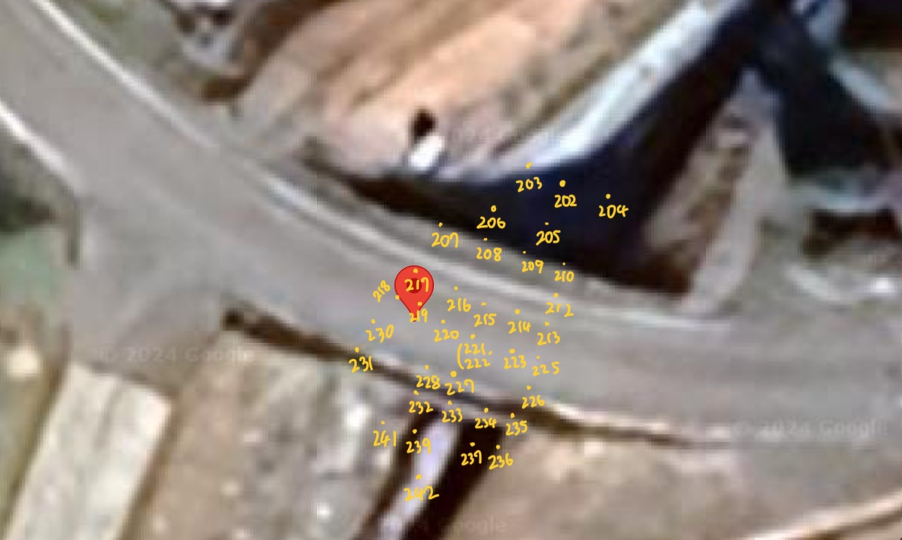
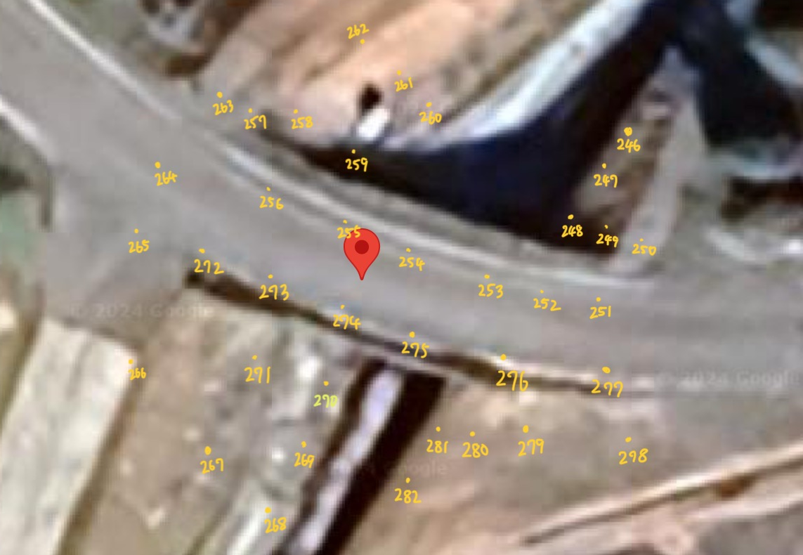
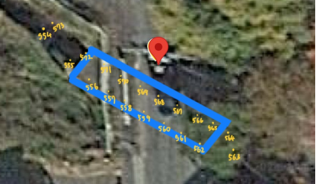

---
layout:
  title:
    visible: true
  description:
    visible: true
  tableOfContents:
    visible: true
  outline:
    visible: true
  pagination:
    visible: true
---

# 間引きの必要性

### 間引きの必要性

すべてのデータをプロットすると大変なので，かなり間引いてよい．目安は，10mくらいで1車線の橋梁であれば，車道34枚，橋の周り4枚，橋の下3枚，両端の支承が見える写真がそれぞれ2～3枚．合計1520枚程度．2車線だったら15\~25枚程度．要するに，橋の状況がわかることが一番大事（ここは知性を要求するところ）

例えばきずな橋を例に取る．

**以下は桁下．**

支承は，217, 230, 213, 226. 橋の下は208, 215, 227, 橋の周りとして205, 237あたり．

**以下は路面．**

車道は252,254, 256, 274, 276. 周りは264, 251, 269, 260

例えば78号橋を例に取る．

少し特殊な橋梁で，556-562が片側の橋，565-571がもう片側の橋． この場合，例えば556, 559, 562, 566, 568, 570,と取れば桁下はカバーできそう．そして周りとして554, 563を取る．

路面は，533, 536, 527, 553あたりを取る．そして周りは，523,
